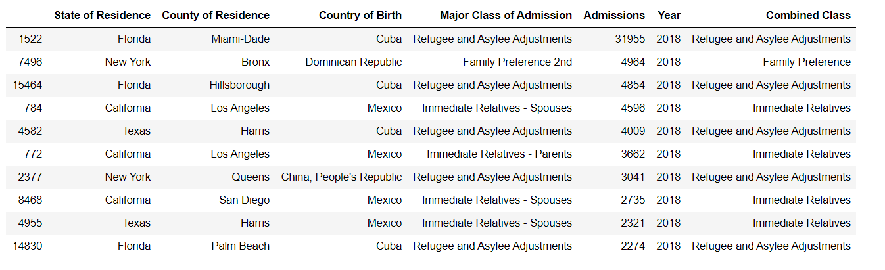
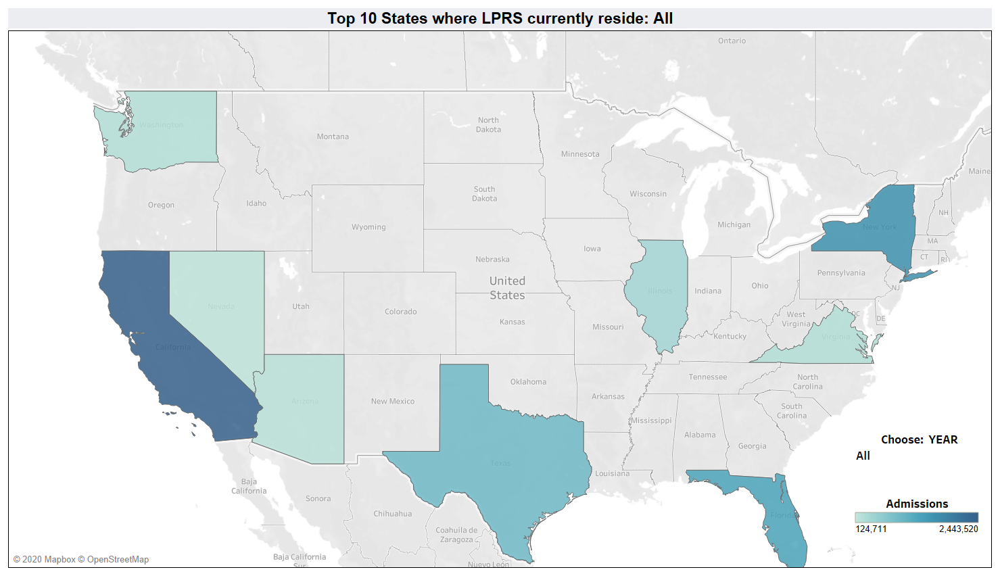
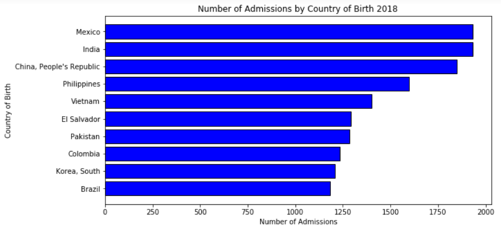
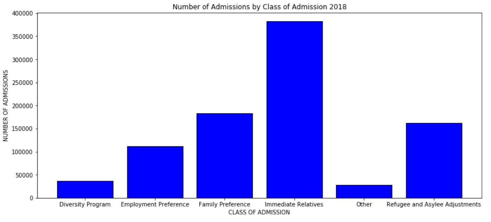

# Lawful Permanent Resident (LPR) Analysis, 2007-2018

## Analysis of Lawful Permanent Residents (LPR) by Country of Birth, County of Current Residence, and Class of Admission

## TABLE OF CONTENTS
* [Motivation](#motivation)
* [Data](#data)
* [Analytical Approach](#analytical-approach)
* [Tools Used](#tools-used)
* [Sources](#sources)
* [Tableau Story](#tableau-story)

### MOTIVATION
Since 2013 I have transcribed immigration hearings for a company contracted to the Department of Justice (DOJ).  I primarily transcribe hearings for undocumented immigrants, but I wanted to know more about where lawful permanent residents (hereafter "LPR" or "LPRs") have arrived from, where they tend to settle, and changes in their resettlement patterns over the past decade.  I also wanted to know what class of admission they came in under and how that pattern has changed, if at all, in the same time period.  I explored the following:

- What is the most common major class of admission (grouped into the six major categories, as the data contained a number of subgroups within each type) and how that has changed, if at all, over the period 2007-2018?
- What are the countries of birth of the top 10 of LPR admissions over the past decade? How have these concentrations changed over that time period?
- What are the top 10 counties in the U.S. in which the highest number of LPRs reside over the past decade? How have these concentrations changed, if at all, over that time period?

### DATA
To answer these questions, I used LPR immigration data provided by the Department of Homeland Security over the years 2007-2018.  This data contains birth country and U.S. state/county data which will be used to provide visual insights on maps.

### ANALYTICAL APPROACH
#### Known Issues and Challenges:
- There were many entries in the `Admissions` column denoted by a `D`.  According to the DHS data website, the D indicates the number is <=3, which may result in a lack of privacy for the LPR if specified.  I replaced the `D` entries with a 1 so that the column could then be converted to an integer type for calculation purposes.  Fully deleting these rows might better represent the diversity in the data.
- The LPR tables are limited to top 200 U.S. counties by size of admission. Only state and county are listed (not city) for current LPR location.  I further limited the data in the mapping to the top 20 counties (which turned out to be located only 9-10 states) to provide a clear visualization.

I created maps in Tableau showing by top 10 states and then top 20 counties where large concentrations of LPRs are located over the decade and by individual year, as well as a map showing the countries where the top 10 highest admissions of LPRs were born.

I used a bar chart to show the top 10 countries of birth for LPRs by year to look at the changes in where LPRs are coming from.  I also created a line chart showing the fluctuations in each major class of admission.  These seem to correlate to world events or political changes (such as a change in U.S. president or political party) and may show a trend in certain areas.

### TOOLS USED
- `Excel` -- LPR data was provided as 11 separate workbooks, which were cleaned and merged in Python.

- `Python/Pandas` - for exploration and aggregation of the data

- `Tableau` - for creating interactive dashboard

- `Visual Studio Code` for editing html/markdown files

- `Git` for version control

### SOURCES
This information was downloaded from:
- https://www.dhs.gov/immigration-statistics/readingroom/LPR/LPRcounty

Further information was found at:
- https://www.dhs.gov/immigration-statistics/lawful-permanent-residents/ImmigrantCOA
- https://www.dhs.gov/disclosure-policy-office-immigration-statistics
- https://www.dhs.gov/immigration-statistics/lawful-permanent-residents/ImmigrantCOA
- https://www.usatoday.com/story/news/nation/2019/11/13/chicago-ranked-top-city-immigrants-new-american-economy-says/4182404002/
- https://www.americanimmigrationcouncil.org/research/immigrants-in-washington

### TABLEAU STORY
Please follow this link to see my analysis and conclusions in Tableau Story format.  This Story is stored on Tableau Public.
https://public.tableau.com/profile/pam.butler#!/vizhome/LPR_Location_Analysis_2007_to_2018/LPRAnalysis